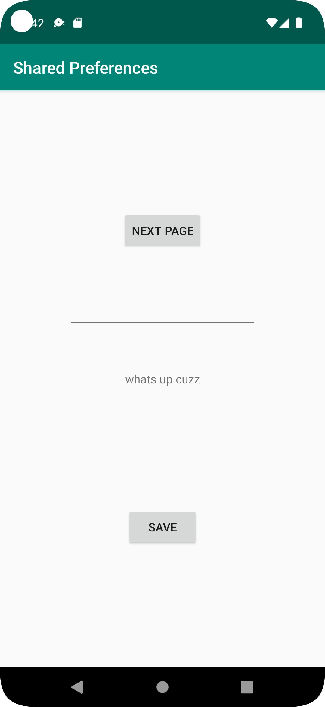
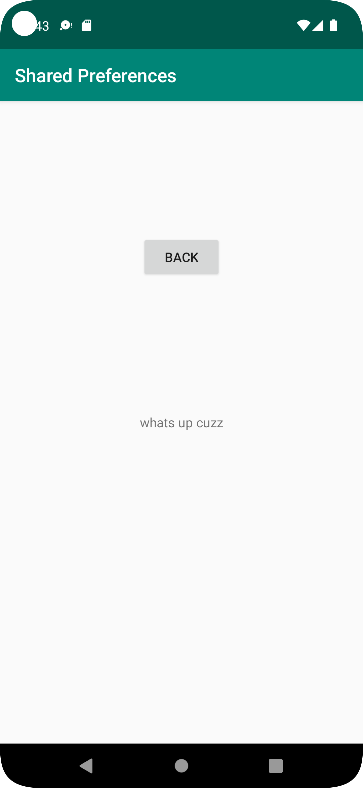

# Rapport

Det första jag gjorde var att skapa layout för mainActivity med två buttons, en textview och en editText. 
en button använd för att byta till second activity och änvänder denna kod för att kunna byta.

    click.setOnClickListener(new View.OnClickListener() {
    @Override
        public void onClick(View view) {
            Intent intent = new Intent(MainActivity.this, MainActivity2.class);
            startActivity(intent);
        }
    });
den andra knappen används för att kunna spara shared prefrence och den använder denna kod. 

        public void savePref(){

            //hämtar texten
            EditText newPrefText=new EditText(this);
            newPrefText=(EditText)findViewById(R.id.settingseditview);
    
            // sparar nya prefrence
            myPreferenceEditor.putString("MyAppPreferenceString", newPrefText.getText().toString());
            myPreferenceEditor.apply();
    
            //skapar en ny instans av textview
            TextView prefTextRef=new TextView(this);
            //länkar preftextref med id
            prefTextRef=(TextView)findViewById(R.id.textView123);
            //visar perference
            prefTextRef.setText(myPreferenceRef.getString("MyAppPreferenceString", "No preference found."));
    
            // Clear the EditText
            newPrefText.setText("");
        }
savePref är det som händer när man clickar på andra knappen. För att prefrence ska visas när man stänger och laddar om programmet 
så måste denna kod läggas till på oncreate också.

            //skapar en ny instans av textview
            TextView prefTextRef=new TextView(this);
            //länkar preftextref med id
            prefTextRef=(TextView)findViewById(R.id.textView123);
            //visar perference
            prefTextRef.setText(myPreferenceRef.getString("MyAppPreferenceString", "No preference found."));

för att det ska fungera så behövs även denna kod

        // används för att kunna hämta lagrade preference
        myPreferenceRef = getSharedPreferences("hej", MODE_PRIVATE);
        // används för att kunna edit preference
        myPreferenceEditor = myPreferenceRef.edit();

Sedan så skapade jag en till activity och fixade layout för den med en button och en textveiw. Här behöver vi endast visa up prefrence 
vi behöver int edit den. för att göra detta så behöver vi hämta shared prefrence och det gör man med den här koden.

    private SharedPreferences myPreferenceRef;

    // används för att kunna hämta lagrade preference
    myPreferenceRef = getSharedPreferences("hej", MODE_PRIVATE);

För att kunna skriva ut prefrence så kan vi nu göra som på första activity. Det enda som behövs byta är id på textView, så att den visas up på rätt plats.

    prefTextRef=(TextView)findViewById(R.id.textView2);

knappen för att byta tillbacks till första activity görs ppå samma sätt som tidigare. 


## Följande grundsyn gäller dugga-svar:

- Ett kortfattat svar är att föredra. Svar som är längre än en sida text (skärmdumpar och programkod exkluderat) är onödigt långt.
- Svaret skall ha minst en snutt programkod.
- Svaret skall inkludera en kort övergripande förklarande text som redogör för vad respektive snutt programkod gör eller som svarar på annan teorifråga.
- Svaret skall ha minst en skärmdump. Skärmdumpar skall illustrera exekvering av relevant programkod. Eventuell text i skärmdumpar måste vara läsbar.
- I de fall detta efterfrågas, dela upp delar av ditt svar i för- och nackdelar. Dina för- respektive nackdelar skall vara i form av punktlistor med kortare stycken (3-4 meningar).

Programkod ska se ut som exemplet nedan. Koden måste vara korrekt indenterad då den blir lättare att läsa vilket gör det lättare att hitta syntaktiska fel.

```
function errorCallback(error) {
    switch(error.code) {
        case error.PERMISSION_DENIED:
            // Geolocation API stöds inte, gör något
            break;
        case error.POSITION_UNAVAILABLE:
            // Misslyckat positionsanrop, gör något
            break;
        case error.UNKNOWN_ERROR:
            // Okänt fel, gör något
            break;
    }
}
```

Bilder läggs i samma mapp som markdown-filen.




Läs gärna:

- Boulos, M.N.K., Warren, J., Gong, J. & Yue, P. (2010) Web GIS in practice VIII: HTML5 and the canvas element for interactive online mapping. International journal of health geographics 9, 14. Shin, Y. &
- Wunsche, B.C. (2013) A smartphone-based golf simulation exercise game for supporting arthritis patients. 2013 28th International Conference of Image and Vision Computing New Zealand (IVCNZ), IEEE, pp. 459–464.
- Wohlin, C., Runeson, P., Höst, M., Ohlsson, M.C., Regnell, B., Wesslén, A. (2012) Experimentation in Software Engineering, Berlin, Heidelberg: Springer Berlin Heidelberg.
